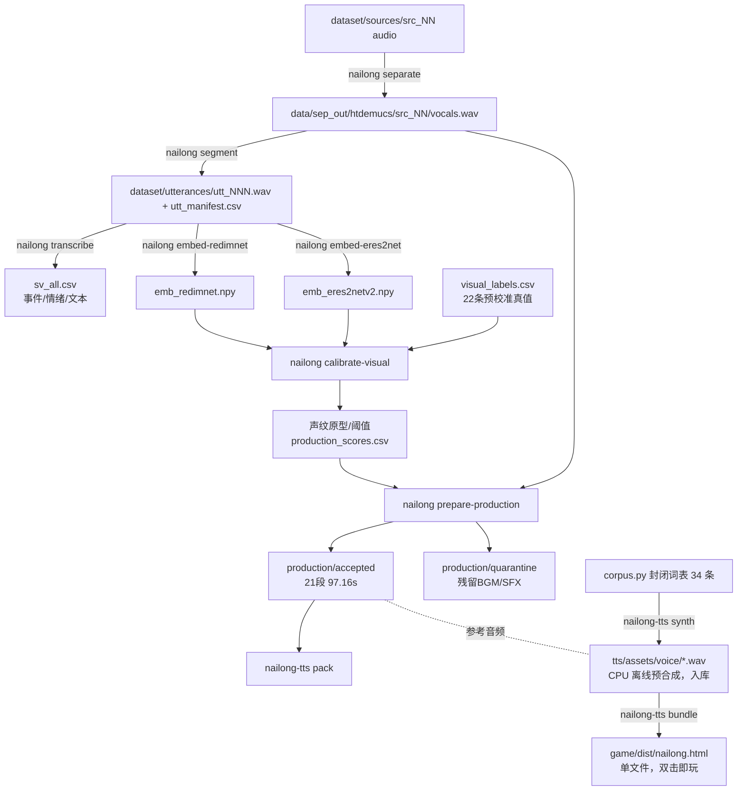

# nailong-ref

从 B 站奶龙短剧里抽取**干净的奶龙人声**，再把它变成能玩的东西：

- `dataset/production/accepted/` —— 自动筛出的候选：21 段 / 97.16s；另有 31 段
  因残留 BGM/SFX 未达门槛放在 `quarantine/`，不会进入生产
- `tts/` —— 奶龙音色语音库：**离线预合成**成 wav，运行期只查表播放
- `game/` —— 配套小游戏；`nailong-tts bundle` 把语音内联成单文件 HTML
- `native/` —— 自研 C++ 推理引擎的调研与实测（**已停手，不阻塞交付**）

硬约束：**不接 LLM、不接 ASR**。TTS 只做单向输出，台词来自封闭词表、
全部离线预合成——这也正是 `native/` 停手的理由：运行期不需要实时合成。

## 仓库布局

| 目录                  | 内容                                                                                                                         |
| --------------------- | ---------------------------------------------------------------------------------------------------------------------------- |
| `src/nailong/`        | 抽取管线：可导入包 + `nailong` CLI                                                                                           |
| `dataset/`            | `production/` 本地候选音频、`calibration/` 视觉校准原型、`manifests/` 清单、`embeddings/` 声纹嵌入；清单和校准结果 **入库** |
| `tts/`                | 封闭词表 + 离线合成 + 打包/内联（独立包 `nailong-tts`）；`assets/voice/` 的预合成 wav **入库**                               |
| `native/`             | 自研 C++/TensorRT 推理的调研、ONNX 导出与实测脚本；`third_party/`、`gsv/`、`build/` **不入库**                               |
| `game/prototype/`     | 两个 canvas 原型（冻结）+ 已合并片头的 `archive.html`                                                                        |
| `tools/vid-analysis/` | 另一支视频结构分析（与主链路无关；截图与音轨不入库）                                                                         |
| `docs/`               | 管线说明、实验结论与当前待解问题                                                                                             |
| `data/`               | 运行时可再生的中间产物，**不入库**                                                                                           |

## 快速开始

Windows + NVIDIA GPU 的规范安装入口：

```powershell
./scripts/setup-gpu.ps1
data/gpu_env/Scripts/python.exe -m nailong.cli build-dataset --device cuda:0 --batch 20
```

脚本安装相互匹配的 CUDA 版 PyTorch、torchaudio、torchvision，并验证
`torch.cuda.is_available()`。本机 RTX 4060 Ti 使用 CUDA 13.0 wheel。
再次运行 `uv sync` 可能用 CPU wheel 覆盖该环境；需要时重跑安装脚本。
模型推理阶段（Demucs、SenseVoice、ReDimNet、ERes2NetV2）默认使用 `cuda:0`，
设备不可用会直接失败；需要诊断时可显式传 `--device cpu`。FFmpeg 解码、CSV、
NumPy 特征和质检仍在 CPU 上运行。

轻量检查或显式 CPU 诊断环境：

```bash
uv venv
uv sync --extra all          # 或按阶段只装需要的 extra
```

只跑数据侧的检查不需要重依赖：

```bash
uv pip install numpy soundfile
uv pip install -e . --no-deps
nailong help
```

`nailong-tts` 的子命令里只有 `synth` 需要外部 GPT-SoVITS 环境（onnxruntime +
`GPT_SoVITS/` 文本前端），`corpus` / `bank` / `bundle` 在项目 venv 里就能跑。
细节见 [tts/README.md](tts/README.md)。

## 管线

### 增量构建与训练门禁

```bash
nailong build-dataset --plan       # 查看执行顺序
nailong build-dataset              # 对已有源续跑全部阶段
nailong build-dataset --batch 20   # 先从本地候选排名导入 20 个新源
nailong-tts review                 # 刷新逐段复核清单
nailong-tts audit                  # 机器审计，未达训练门槛返回非零
nailong-tts pack                   # 只有 audit 通过才写正式训练列表
```

候选输入默认为 `data/eval_sep/visual/candidate_scores.csv` 和其中的 `local_file`。
`ingest-candidates` 按预筛目标语音秒数排序，跳过重复 BV 号与重复音频哈希，分配稳定的
`src_NN` 并追加 `source_manifest.csv`。从零开始时，先取得有使用权的源音频并运行
`nailong rank-sources` 生成排名；本地缓存不是仓库交付物。

已接入官方账号投稿列表的有界候选缓存入口，可重复运行，已下载的 BV 号会跳过：

```powershell
data/gpu_env/Scripts/python.exe -m nailong.cli fetch-public --scan 50 --limit 10
data/gpu_env/Scripts/python.exe -m nailong.cli rank-sources data/eval_sep/official/audio_index data/eval_sep/official/candidate_scores.csv --device cuda:0
data/gpu_env/Scripts/python.exe -m nailong.cli build-dataset --batch 10 --ranking data/eval_sep/official/candidate_scores.csv --device cuda:0
```

公开视频可访问不等于取得训练或发布授权；来源链接与作者记录在源清单中，正式使用前仍需核对权利。
前 5 条官方视频的混音预筛约有 80.7s 目标声线，但严格分离与音质门控只新增
1 段 / 4.08s，因此不宜把预筛时长当成训练集时长。

`dataset/manifests/training_review.csv` 是正式训练集的逐段复核入口：听音并核对
说话人、文字、音效，修改 `text`，以 `approved=yes` 或 `no` 明确判定。音频 SHA-256
变化会使原复核失效。正式门槛暂定 **至少 200 段、30 分钟**，并要求所有入包样本
通过复核、音频格式/哈希/时长/静音/削波检查。`pack --experimental` 只豁免数量门槛，
仍须逐段复核。门槛是项目交付目标，不代表任何 TTS 架构的通用最低需求。

原有转载源缓存的预筛目标语音总长约 1191 秒，且分离、声纹和音质门控后会进一步减少；
现有 21 段 / 97.16 秒已逐段检查可取得的画面（其中 1 段只有部分画面）：
6 段 / 32.52 秒因跨角色发言被拒绝，
15 段 / 64.64 秒仍待听音与台词校对，尚无片段获正式批准。因此当前仓库
**没有通过正式训练门禁的数据包**。逐段画面证据见
`dataset/manifests/visual_review.csv`，`training_review.csv` 中的 `approved=no`
会被后续 `review` 保留。

链路是**单向**的，每一步只读上一步的产物：



```bash
nailong separate            # 音视频源 -> demucs 人声轨
nailong segment             # 只追加新源，旧 idx 不重排
nailong transcribe          # 只追加 SenseVoice 事件/情绪/文本
nailong embed-redimnet      # 只追加 ReDimNet 审计嵌入
nailong embed-eres2net      # 只追加 ERes2NetV2 主模型嵌入（默认 CUDA）
nailong calibrate-visual    # 视觉真值只在预校准阶段使用
nailong prepare-production  # 生产时纯音频判定 + BGM/SFX 门控
nailong-tts pack            # 打包成训练格式（filelist.txt / metadata.csv）
nailong-tts corpus          # 词表 -> tts/build/voice_lines.csv
nailong-tts synth           # 预合成语音（需外部 GPT-SoVITS 环境）
nailong-tts bank            # 校验语音资源齐全
nailong-tts bundle          # 内联语音 -> 单文件游戏
```

`nailong help` 列出全部阶段（含 `annotate` / `reel` / `band` / `sanity` 等工具）。

## 数据契约

清单是唯一的跨阶段接口，都在 `dataset/manifests/`，主键为 `idx`：

| 文件                      | 字段                                                     |
| ------------------------- | -------------------------------------------------------- |
| `source_manifest.csv`     | 源编号、BV 号、标题、作者、筛选依据、文件 SHA-256       |
| `utt_manifest.csv`        | idx, src, t0, t1, dur；扩数据时 idx 只追加、不重排       |
| `sv_all.csv`              | idx, src, t0, dur, event, emotion, text                  |
| `labels.csv`              | idx, label, source（human > visual）                     |
| `visual_labels.csv`       | 22 条视觉真值、证据 BV 号、音视频偏移和置信度            |
| `visual_review.csv`       | 21 段生产候选的逐段画面证据、角色判断和音频核验状态       |
| `production_scores.csv`   | 双模型分数、ERes2NetV2 生产分数和 accept/review/reject   |
| `production_manifest.csv` | accepted/quarantine、声纹依据、残留轨差和 SHA-256        |
| `separation_manifest.csv` | 40 个源的 HTDemucs stem 与源文件 SHA-256                 |
| `model_manifest.csv`      | 模型 ID、权重大小、SHA-256 和许可证                      |

阈值与路径全部集中在 [config.py](src/nailong/config.py)，不再散落在各脚本里。

## 已知缺口

- `data/sep_out/` 与 `data/sep_in/` 曾被删除且无脚本可重建，现已补上 `nailong separate`。
  **重跑管线必须先执行它**（需 `--extra sep`）。
- `pretrained_models/` 里 5 个文件全是 0 字节（speechbrain 下载失败残骸），已忽略。
- `tts/assets/voice/` 只有 **14 条**（12 材质 + `form0`/`form1`），词表共 34 条；
  `voice_manifest.csv` 还没生成过，`nailong-tts bank` 会因此报缺清单 →
  补齐跑一次 `nailong-tts synth` 即可。
- `native/` 重建需要两样外部输入：TensorRT 11.3 Windows x64 zip（官方许可页，
  要接受许可）与 `native/scripts/fetch_gsv_models.py` 拉的 ~1.28GB 权重
  （HF 直连会断，得走 `HF_ENDPOINT=https://hf-mirror.com`）。
- **仓库只收代码、清单、校准结果、嵌入与已发布语音库**（二进制资产走 Git LFS）。以下内容存在本地但不入库，
  克隆后需要重建或另行取得：

  | 内容                                      | 如何拿回                                     |
  | ----------------------------------------- | -------------------------------------------- |
  | `dataset/sources/*.mp4`                   | 需从 B 站另行下载（唯一无法自动重建的一项）  |
  | `dataset/utterances/`                     | `nailong segment`（需先 `nailong separate`） |
  | `dataset/production/{accepted,quarantine}/*.wav` | `nailong prepare-production`；均为未完成听音验收的候选 |
  | `dataset/queries/`                        | `nailong annotate query`                     |
  | `dataset/reels/`                          | `nailong reel`                               |
  | `tools/vid-analysis/*.png`、`audio_*.wav` | 重跑该目录下的 `analyze.py`                  |
  | `native/third_party/`、`native/gsv/`      | 自行下载 SDK / 重新导出 ONNX 并建引擎        |
  | `tts/build/`、`game/dist/`                | `nailong-tts pack` / `nailong-tts bundle`    |

## 结论备忘

声纹路线在这批素材上踩过的坑（换更强模型不等于能分开、视觉校准后
ERes2NetV2 优于 ReDimNet、低频占比不能当 BGM 判据）记在 [docs/FINDINGS.md](docs/FINDINGS.md)，
动手前先看，避免重复投入。

语音侧的构建和参考音频约束记在 [tts/README.md](tts/README.md)。

若要继续扩数据集或换 TTS 模型，先看 [docs/ISSUES.md](docs/ISSUES.md)——
源素材现为 25.65 分钟、视觉真值仍只有 22 条、自动候选 97.16 秒；语料已越过
一分钟级试验下限，但真值规模和角色混淆风险仍是硬约束。
