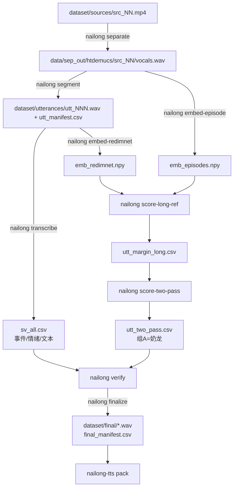

# nailong-ref

从 B 站奶龙短剧里抽取**干净的奶龙人声**，用于两条下游：

- `tts/` —— 奶龙音色 TTS（本期只做数据集打包与推理接口预留）
- `game/` —— 配套小游戏（原型已冻结，暂不动）

硬约束：**不接 LLM、不接 ASR**。TTS 只做单向输出，所有台词离线预合成。

## 仓库布局

| 目录                  | 内容                                                                                                                                                          |
| --------------------- | ------------------------------------------------------------------------------------------------------------------------------------------------------------- |
| `src/nailong/`        | 抽取管线：可导入包 + `nailong` CLI                                                                                                                            |
| `dataset/`            | `manifests/` 清单、`final/` 交付片段、`embeddings/` 声纹嵌入 **入库**；`sources/`、`utterances/`、`queries/`、`reels/` 体积大且可重建，**不入库**（本地保留） |
| `tts/`                | 数据集打包 + 引擎接口（独立包 `nailong-tts`）                                                                                                                 |
| `game/prototype/`     | 两个 canvas 原型（冻结）                                                                                                                                      |
| `tools/vid-analysis/` | 另一支视频结构分析（与主链路无关；截图与音轨不入库）                                                                                                          |
| `docs/`               | 管线说明、实验结论与当前待解问题                                                                                                                              |
| `data/`               | 运行时可再生的中间产物，**不入库**                                                                                                                            |

## 快速开始

```bash
uv venv
uv sync --extra all          # 或按阶段只装需要的 extra
```

只跑数据侧的检查不需要重依赖：

```bash
uv pip install numpy soundfile
uv pip install -e . --no-deps
nailong help
```

## 管线

链路是**单向**的，每一步只读上一步的产物：



```bash
nailong separate            # mp4 -> demucs 人声轨
nailong segment             # 切句
nailong transcribe          # SenseVoice 事件/情绪/文本
nailong embed-redimnet      # 声纹嵌入
nailong score-long-ref      # 长参考初筛
nailong score-two-pass      # 两遍迭代细化
nailong verify              # 三条独立证据验证组A
nailong finalize            # 出交付片段
nailong-tts pack            # 打包成训练格式
```

`nailong help` 列出全部阶段（含 `annotate` / `reel` / `band` / `sanity` 等工具）。

## 数据契约

清单是唯一的跨阶段接口，都在 `dataset/manifests/`，主键为 `idx`：

| 文件                  | 字段                                                     |
| --------------------- | -------------------------------------------------------- |
| `utt_manifest.csv`    | idx, src, t0, t1, dur, f0_med, centroid, cluster, reel_t |
| `sv_all.csv`          | idx, src, t0, dur, event, emotion, text                  |
| `utt_margin_long.csv` | idx, src, t0, dur, sim_pos, sim_neg, margin              |
| `utt_two_pass.csv`    | idx, src, t0, dur, simA, simB, margin, group             |
| `final_manifest.csv`  | file, src, t0, t1, dur, min_simA, text                   |
| `labels.csv`          | idx, label, source（human 优先于 weak）                  |

阈值与路径全部集中在 [config.py](src/nailong/config.py)，不再散落在各脚本里。

## 已知缺口

- `data/sep_out/` 与 `data/sep_in/` 曾被删除且无脚本可重建，现已补上 `nailong separate`。
  **重跑管线必须先执行它**（需 `--extra sep`）。
- 现有的 `dataset/final/` 11 段产生于 `final_manifest.csv` 加入之前，
  因此 `nailong-tts pack` 目前会报缺清单。跑 `nailong finalize --manifest-only`
  可只补清单（不读 `data/sep_out`），或完整重跑。
- `pretrained_models/` 里 5 个文件全是 0 字节（speechbrain 下载失败残骸），已忽略。
- **仓库只收代码、清单、交付片段与嵌入**（LFS 约 3.7MB）。以下内容存在本地但不入库，
  克隆后需要重建或另行取得：

  | 内容                                      | 如何拿回                                     |
  | ----------------------------------------- | -------------------------------------------- |
  | `dataset/sources/*.mp4`                   | 需从 B 站另行下载（唯一无法自动重建的一项）  |
  | `dataset/utterances/`                     | `nailong segment`（需先 `nailong separate`） |
  | `dataset/queries/`                        | `nailong annotate query`                     |
  | `dataset/reels/`                          | `nailong reel`                               |
  | `tools/vid-analysis/*.png`、`audio_*.wav` | 重跑该目录下的 `analyze.py`                  |

  **含这些文件的完整原始历史保留在本地分支 `backup/pre-slim`（未推送）**，
  需要时 `git switch backup/pre-slim` 取用。

## 结论备忘

声纹路线在这批素材上踩过的坑（换更强模型不等于能分开、短句嵌入不可靠、
低频占比不能当 BGM 判据）记在 [docs/FINDINGS.md](docs/FINDINGS.md)，
动手前先看，避免重复投入。

若要继续扩数据集或换 TTS 模型，先看 [docs/ISSUES.md](docs/ISSUES.md)——
源素材仅 4.53 分钟、产出率已达 27.7%、ground truth 只有 2 条人工标注，
在动手前这些是硬约束。
